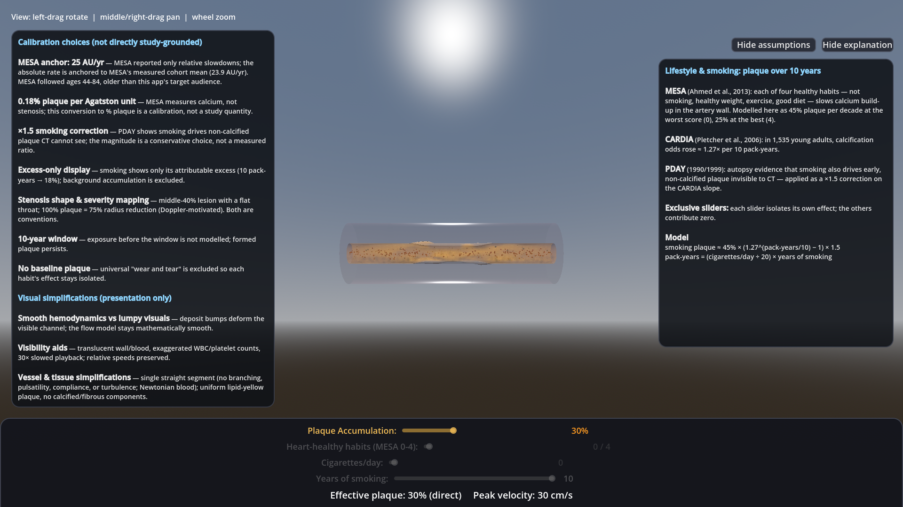

# Coronary Artery Stenosis — Interactive 3D Visualization

An interactive, educational 3D visualization of atherosclerosis in a coronary
artery, built with **Godot 4.7** and a **Rust GDExtension**. It shows how
plaque narrowing changes blood flow — higher velocity, a pressure dip at the
throat, and the extra inlet pressure the heart needs — and lets you drive
plaque build-up three ways:

- **Direct plaque accumulation** (0–100%)
- **Lifestyle habits** — MESA low-risk lifestyle score 0–4
- **Smoking** — cigarettes/day × years of smoking (CARDIA dose-response with a
  PDAY non-calcified-plaque correction)

The three sources are exclusive: adjusting any slider makes its group the sole
plaque contributor, so each habit's effect can be inspected in isolation.



**Educational only — not a diagnostic tool.** The hemodynamic model
(continuity + Bernoulli + Poiseuille) and the epidemiological mappings are
simplified; every calibration choice that lacks direct study grounding is
listed inside the app ("Model assumptions" panel) and in
[architecture.md](architecture.md).

## Running

**Desktop** — requires Godot 4.7 and a Rust toolchain:

```powershell
cargo build
# then open godot/project.godot in Godot 4.7 and press Play,
# or: godot --path godot
```

**Browser (Wasm)** — requires [emsdk 3.1.74](https://github.com/emscripten-core/emsdk)
and a pinned Rust nightly (see `scripts/build_web.ps1` for details):

```powershell
powershell -File scripts\build_web.ps1     # → build\web\index.html
# serve the folder over any static HTTP server, e.g.:
python -m http.server 8000 --directory build\web
```

## Tests

- **Rust unit tests:** `cargo test`
- **Visual/E2E suite** (10 tests: screenshots, input simulation, camera,
  exclusive-slider behaviour, rebuild cost): 
  `powershell -File scripts\run_visual_tests.ps1`
- **Deterministic movie capture:** `scripts\capture_movie.ps1`

## Documentation

[architecture.md](architecture.md) is the full engineering reference: system
boundaries, the hemodynamic model, study grounding (MESA / CARDIA / PDAY),
calibration constants, the visual-testing pipeline, and the Web export.

## Notes

- The Rust GDExtension web export uses godot-rust's experimental
  `experimental-wasm` feature; desktop builds are unaffected.
- No medical advice: the numbers shown are model outputs for teaching, not
  clinical measurements.
