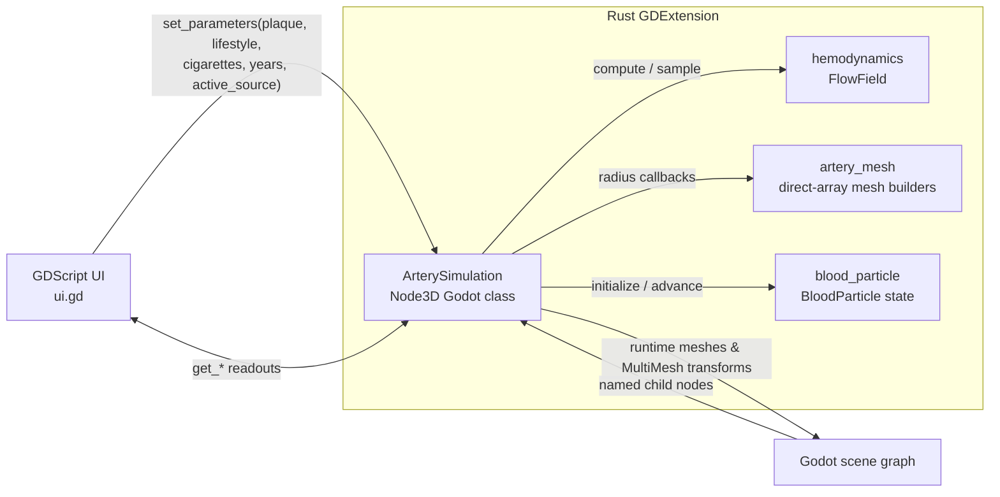

# Architecture Reference

> **Audience:** Engineers and AI agents modifying this repository.
>
> **Scope:** Implementation topology, ownership, data flow, contracts, and maintenance constraints. This is not end-user documentation.
>
> **Maintenance rule:** Update this document in the same change that modifies any described module, scene-node contract, GDExtension API, physical-model assumption, dependency, or build/runtime integration. Keep the descriptions factual: document the code that exists, then separately record intentional deviations or known constraints.

## 1. System Boundary

This repository implements an interactive 3D artery-stenosis visualization as a **Godot 4 project** (`godot/`) backed by a **Rust GDExtension** (`rust/`).

The runtime is split across two execution environments:

- **Godot / GDScript:** owns the scene graph, camera, static vessel wall, UI tree, signal wiring, and text rendering.
- **Rust / GDExtension:** owns the hemodynamic model, procedural blood/plaque meshes, particle state, per-frame particle motion, and callable simulation API.

The Rust crate is compiled as a platform dynamic library and loaded by Godot through `godot/rust.gdextension`.

## 2. Repository Map

```text
T5/
├── Cargo.toml                         # Cargo workspace; includes rust/
├── Cargo.lock                         # Resolved Rust dependency graph
├── .cargo/config.toml                 # Wasm (Emscripten) linker flags for the web build
├── .gitignore                         # Project-wide OS, editor, Godot-cache, and build-artifact exclusions
├── README.md                          # Short project overview (this document is the deep reference)
├── architecture.md                    # This engineering architecture reference
├── rust/
│   ├── Cargo.toml                     # `rust` cdylib crate and dependencies
│   ├── .gitignore                     # Ignores crate-local target/ output
│   └── src/
│       ├── lib.rs                     # GDExtension registration and module root
│       ├── artery_simulation.rs       # Godot class; runtime orchestration
│       ├── artery_mesh.rs             # Procedural tube/shell mesh construction
│       ├── blood_particle.rs          # Per-particle state and random spawning
│       ├── smoking_model.rs           # CARDIA/PDAY-grounded smoking dose-response + tests
│       └── hemodynamics.rs            # Geometry and flow/pressure model + tests
├── tests/
│   └── e2e/
│       ├── conftest.py               # godot-e2e fixtures: launch, seed, freeze, artefact dir
│       ├── test_visual_smoke.py      # Screenshot + input-simulation smoke tests
│       └── baselines/                # Committed reference screenshots for diffing
├── docs/
│   └── screenshot.png                # README illustration (copied from the E2E baselines)
├── scripts/
│   ├── run_visual_tests.ps1          # Build → E2E suite → ImageMagick compare → metrics.txt → prune artefacts
│   ├── capture_movie.ps1             # Deterministic Movie Maker PNG frame sequence capture
│   └── build_web.ps1                 # Wasm GDExtension build + Godot Web export → build/web/
└── godot/
    ├── addons/godot_e2e/             # Automation-server addon (dormant without --e2e)
    ├── export_presets.cfg            # Export presets (Web/Wasm build; see §10.x)
    ├── project.godot                  # Godot project and startup-scene configuration
    ├── rust.gdextension               # Platform library paths and entry symbol
    ├── main.tscn                      # Scene graph and static visual/UI structure
    └── scripts/
        ├── camera_controller.gd       # Orbit/pan/zoom viewport controls
        ├── explanation_panel.gd       # Toggleable explanation panel + model-assumptions info box
        ├── perf_probe.gd              # Performance-monitor getters for the E2E suite
        └── ui.gd                      # UI-to-Rust bridge and readout refresh
```

Generated build output belongs below the workspace `target/` directory. Godot editor metadata and caches belong below `godot/.godot/`; neither is implementation source.

## 3. Component Model



`ArterySimulation` is the integration boundary. It is the only Rust type exposed to Godot as a custom node and the only Rust module that directly accesses Godot scene nodes.

## 4. Startup and Runtime Sequence

1. Godot starts `res://main.tscn`, as configured by `godot/project.godot`.
2. Godot loads `rust.gdextension`, resolves `gdext_rust_init`, and registers the Rust extension library declared in `rust/src/lib.rs`.
3. Godot instantiates the `ArterySimulation` node in `main.tscn` and resolves its named `Blood`, `Plaque`, `ParticlesRbc`, `ParticlesWbc`, and `ParticlesPlatelet` children through `OnReady` fields.
4. `ArterySimulation::ready()` creates materials (and applies the wall material override), configures three separate cell-type `MultiMesh`es (RBCs, WBCs, platelets), distributes particles randomly, and defers the first (heavy) `rebuild()` to the first process frame so the E2E automation handshake is not blocked.
5. `UIRoot._ready()` applies the `DEVIN_INITIAL_*` environment overrides, connects all four slider `value_changed` signals, applies the rounded, semi-transparent dark styles to the bottom panel, explanation panel, assumptions box, and sliders, and immediately invokes the handlers with the sliders' configured values.
6. The UI handler calls `ArterySimulation.set_parameters(plaque, lifestyle, cigarettes, years_of_smoking, active_source)`. This rebuilds the flow field and dynamic geometry once, then the UI reads current statistics through `get_*` methods.
7. On each Godot process frame, `ArterySimulation::process(delta)` advances particle positions using the sampled local velocity and writes their transforms into the `MultiMesh`.

## 5. Godot Scene and Node Contracts

### 5.1 Static scene ownership

`godot/main.tscn` owns the static graph.

**Window scaling.** `project.godot` sets `display/window/stretch/mode="canvas_items"` with `aspect="expand"`: the UI canvas expands to fill the window at any aspect ratio (no letterboxing) instead of cropping a fixed 1920×1080 canvas, and the bottom `PanelContainer` is anchored to the bottom edge with a zero-height rect and `grow_vertical = 0`, so it auto-sizes upward to fit its rows.

| Node path | Type | Owner / responsibility |
| --- | --- | --- |
| `Main` | `Node3D` | Scene root. |
| `Main/WorldEnvironment` | `WorldEnvironment` | Sky and ambient lighting. |
| `Main/Sun` | `DirectionalLight3D` | Directional lighting and shadows. |
| `Main/Camera3D` | `Camera3D` | Active camera with free orbit, pan, and zoom controls from `scripts/camera_controller.gd`. |
| `Main/Artery` | `ArterySimulation` | Rust-owned dynamic simulation node. Marked scene-unique for `%Artery`. |
| `Main/PerfProbe` | `Node` | Exposes `Performance` monitors as plain float getters (`scripts/perf_probe.gd`) for the E2E suite; carries no simulation state. |
| `Main/Artery/Wall` | `MeshInstance3D` | Static `CylinderMesh` representing the outer vessel wall. Rust applies a smooth, wet, glass-like pink material override and keeps it translucent so particle motion inside remains visible. |
| `Main/Artery/Blood` | `MeshInstance3D` | Empty in the scene; Rust assigns a procedural solid-lumen mesh, also translucent so particles inside it stay visible. |
| `Main/Artery/Plaque` | `MeshInstance3D` | Empty in the scene; Rust assigns a procedural **closed annular plaque volume** with deterministic surface lumps and controls visibility. |
| `Main/Artery/ParticlesRbc` | `MultiMeshInstance3D` | Empty in the scene; Rust assigns a low-poly red-blood-cell `MultiMesh` and per-instance transforms. |
| `Main/Artery/ParticlesWbc` | `MultiMeshInstance3D` | Empty in the scene; Rust assigns a low-poly white-blood-cell `MultiMesh` and per-instance transforms. |
| `Main/Artery/ParticlesPlatelet` | `MultiMeshInstance3D` | Empty in the scene; Rust assigns a low-poly platelet `MultiMesh` and per-instance transforms. |
| `Main/UI/UIRoot/ExplanationUI` | `Control` | Container for the scientific explanation panel, the model-assumptions info box, and their toggle buttons; driven by `scripts/explanation_panel.gd`. |
| `Main/UI/UIRoot/ExplanationUI/ExplanationToggle` | `Button` | Always-visible top-right button that shows or hides `ExplanationPanel`. |
| `Main/UI/UIRoot/ExplanationUI/ExplanationPanel` | `PanelContainer` | 2D side panel (top right) rendering the scientific explanation as BBCode. |
| `Main/UI/UIRoot/ExplanationUI/ExplanationPanel/Margin/ExplanationText` | `RichTextLabel` | Displays the explanation content as BBCode defined in `explanation_panel.gd` (`EXPLANATION_TEXT`). The former texture pipeline (`assets/callouts/explanation_panel.tex`/`.png`, Pillow-rendered) has been removed from the repository. |
 `Main/UI/UIRoot/ExplanationUI/AssumptionsToggle` | `Button` | Always-visible top-right button that shows or hides `AssumptionsPanel`. |
 `Main/UI/UIRoot/ExplanationUI/AssumptionsPanel` | `PanelContainer` | Info box (top left) listing every calibration choice that lacks direct study grounding; BBCode content lives in `explanation_panel.gd` (`ASSUMPTIONS_TEXT`). |
| `Main/UI/UIRoot` | `Control` | Full-screen UI root driven by `scripts/ui.gd`. |

### 5.2 Required invariants

The following names and types are implementation contracts, not presentation details:

- `ArterySimulation` requires direct children named **`Blood`**, **`Plaque`**, **`ParticlesRbc`**, **`ParticlesWbc`**, and **`ParticlesPlatelet`**, with types `MeshInstance3D`, `MeshInstance3D`, `MultiMeshInstance3D`, `MultiMeshInstance3D`, and `MultiMeshInstance3D`, respectively. The Rust `#[init(node = ...)]` fields depend on them.
- The `Artery` node must remain unique in its scene owner because `ui.gd` resolves it with `%Artery`.
- `Blood`, `Plaque`, `ParticlesRbc`, `ParticlesWbc`, and `ParticlesPlatelet` do not receive persistent scene mesh assignments; `ArterySimulation` builds and assigns them at runtime.
- The visual vessel axis is Godot **Y**. Normalized vessel position `t = 0` maps to `y = -VISUAL_LENGTH / 2`; `t = 1` maps to `y = +VISUAL_LENGTH / 2`.
- The explanation panel is a 2D UI overlay under `Main/UI/UIRoot/ExplanationUI`, not a 3D scene object. Its position, size, and toggle-button layout are authored in `main.tscn` and do not depend on the vessel geometry constants.

Changing any of these requires coordinated changes to `main.tscn`, `artery_simulation.rs`, and/or `ui.gd`.

## 6. Rust Module Responsibilities

### 6.1 `rust/src/lib.rs` — Extension root

- Declares the five internal modules.
- Declares `MyExtension` and marks its `ExtensionLibrary` implementation with `#[gdextension]`.
- Does not contain simulation logic; it is the registration boundary that produces the entry symbol expected by Godot.

### 6.2 `rust/src/hemodynamics.rs` — Domain model

Owns the vessel geometry and the sampled flow/pressure solution. It has no Godot dependency and is unit tested in place.

**Primary types and functions**

| Symbol | Responsibility |
| --- | --- |
| `stenosis_bump(t)` | Creates a C1-continuous, flat-topped narrowing profile: zero outside the constricted zone, cosine ramps at the shoulders, and one at the throat plateau. |
| `lumen_radius_m(t, plaque_fraction)` | Converts position and plaque fraction into a physical lumen radius. Inputs are defensively clamped to `[0, 1]`. |
| `FlowSample` | One sampled vessel cross-section: radius (m), mean velocity (m/s), and static pressure (Pa). |
| `FlowField` | The complete sampled solution, including the constant volumetric flow rate and private sample vector. |
| `FlowField::compute` | Creates the field using 1D sampled geometry, continuity, trapezoidal viscous-loss integration, and outlet-referenced pressure reconstruction. |
| `FlowField::{velocity_at,radius_at,pressure_at}` | Linearly interpolated queries at normalized position `t`. |
| `FlowField::{inlet_pressure_pa,outlet_pressure_pa,min_pressure_pa,max_velocity_m_s}` | Summary queries used by the Godot layer. |
| `pa_to_mmhg` | Unit conversion for UI-facing pressure values. |

**Model assumptions**

- Blood is treated as incompressible with constant density and dynamic viscosity.
- The model represents a horizontal, 1D vessel segment; elevation, pulsatility, turbulence, wall compliance, branching, and non-Newtonian rheology are excluded.
- Volumetric flow `Q` is held constant using the healthy cross-section and baseline mean velocity.
- The outlet pressure is fixed at `MEAN_ARTERIAL_PRESSURE_PA`; inlet pressure is solved backward.
- Local velocity uses continuity: `v(t) = Q / (pi * r(t)^2)`.
- Viscous pressure loss integrates `8 * viscosity / (pi * r^4)` along the segment with the trapezoidal rule.
- Pressure combines the outlet reference, kinetic-energy difference, and remaining viscous loss. The local pressure minimum models the Venturi dip.

**Domain units**

| Quantity | Unit |
| --- | --- |
| Position `t` | normalized `[0, 1]` |
| Radius / vessel length | meters |
| Velocity | m/s |
| Pressure | Pa internally; mmHg at the Godot API |
| Flow rate | m³/s internally; mL/s at the Godot API |

### 6.3 `rust/src/artery_mesh.rs` — Geometry adapter

Builds Godot `ArrayMesh` instances from a radius callback. It deliberately does not know about plaque percentage or hemodynamics.

- Meshes are assembled as plain Rust vectors (positions, UVs, indices, area-weighted normal accumulation) and committed with a *single* `ArrayMesh::add_surface_from_arrays` call. The previous `SurfaceTool`-based builder spent ~65 ms per rebuild on per-vertex FFI plus `index()`/`generate_normals()`; the direct-array builder does the same work in ~1 ms, which is what makes slider drags smooth.
- `build_solid_tube(...)` creates the blood lumen as a lateral surface with two disk caps. Its radius callback is the *visual* channel boundary: the smooth hemodynamic lumen minus the deposit's lumen-facing protrusions.
- `build_plaque_volume(...)` creates the plaque as a closed annular volume: an outer lateral surface at the healthy-lumen boundary plus chunky clumps, an inner lateral surface just outside the smooth hemodynamic lumen, and annular end caps at the vessel ends. The inner surface is wound with flipped normals so it is back-face culled when viewed from outside, avoiding the z-fighting that the earlier single-sided shell was introduced to prevent. A small baseline thickness (proportional to `fraction * healthy_radius`) keeps the end caps visible even where the stenosis envelope is zero, so the deposit reads as a solid ring rather than a hollow film.
- `add_lateral_surface(...)` tessellates rings × radial segments into triangles over a welded vertex grid (the UV seam column shares the first column's normal accumulator), so surfaces shade smoothly. Its `radius_at(t, angle)` callback receives both axial position and polar angle, allowing angular variation (plaque clumps) without changing the axial flow model.
- `add_quad(...)` controls winding.
- Normals are accumulated per vertex from face normals (area-weighted via the welded grid) and normalized once in `into_mesh`, which commits the surface; an optional per-vertex `COLOR` array (used by the plaque volume for per-vertex alpha) is committed alongside when filled.

The module takes radius callbacks so its geometry remains reusable with any radius profile that maps normalized `t` to a Godot-space radius.

### 6.4 `rust/src/blood_particle.rs` — Blood-cell particle model

`CellType` distinguishes the three visible blood constituents: RBCs, WBCs, and platelets. `CellType::target_counts()` gives a representative distribution (RBCs dominate, platelets outnumber WBCs, WBC counts slightly exaggerated so they remain identifiable).

`BloodParticle` stores presentation state for one cell:

- `cell_type`: RBC / WBC / platelet.
- `t`: normalized axial position.
- `radius_frac`: radial position as a fraction of the **current local lumen radius**.
- `angle`: angular position around the vessel axis in radians.
- `orientation`: random 3D rotation so the low-poly cells do not all face the same way.

Spawn distributions mirror real hemodynamics:

- RBCs use a centre-biased distribution (`1 - sqrt(u)`) reflecting the Fahraeus-Lindqvist / axial-migration effect.
- WBCs and platelets use a wall-biased distribution reflecting margination.

Storing a fraction—not a fixed world-space radius—keeps particles inside the narrowing lumen during plaque changes.

### 6.5 `rust/src/smoking_model.rs` — Smoking dose-response (CARDIA + PDAY)

Pure, Godot-free module implementing the 10-year plaque contribution of smoking.

**Study grounding**

- **CARDIA (primary)** — Pletcher et al., *Arch Intern Med* 2006: 1,535 CARDIA smokers followed from 1985 with coronary calcification measured at Year 15; adjusted odds of coronary calcification rose ~**1.27× per 10 pack-years** (95% CI 1.01–1.60 menthol / 1.06–1.68 non-menthol). This supplies the dose-response slope, applied log-linearly: `multiplier = 1.27^(pack-years/10)`.
- **PDAY (supplementary)** — Strong et al. (JAMA 1990; ATVB 1994/1999) measured atherosclerosis *directly at autopsy* (fatty streaks + raised lesions as percent intimal surface of the aorta and right coronary artery) in 15–34-year-olds, with smoking verified by postmortem **serum thiocyanate** — an objective biochemical marker, not a questionnaire. PDAY shows smoking accelerates *early, largely non-calcified* plaque, which a calcium-score endpoint (CARDIA's CAC) cannot see. Applied as a documented ×1.5 correction on the CARDIA-derived excess (`PDAY_NONCALCIFIED_CORRECTION`).
- **Quitting** — CARDIA tracks cessation prospectively; within the 10-year window, pack-years count only the years actually smoked. Plaque already formed does not regress (corroborated by calcification cohorts: former smokers' scores stay elevated for decades), so quitting stops further smoker-rate accumulation without removing what exists.

**Model**

```
years_smoked = clamp(years_of_smoking, 0, 10)            // 0 if never smoker
pack_years   = (cigarettes_per_day / 20) × years_smoked
multiplier   = 1.27^(pack-years / 10)
contribution = 45% × (multiplier − 1) × 1.5              // clamped to [0, 100]
```

The 45% base is the same MESA score-0 reference the lifestyle slider uses, so all plaque sources share one scale. Range: 0% (never smoker) → ~41% (40 cigarettes/day, 10 years of smoking). The "years of smoking" slider (0-10) sets the years of the 10-year window spent smoking directly — quitting is expressed as *fewer smoking years*, and plaque already formed persists.

### 6.6 `rust/src/artery_simulation.rs` — Orchestrator and Godot API

Defines the non-public `ArterySimulation` Rust struct as a public Godot `Node3D` class through `#[derive(GodotClass)]` and `#[godot_api]`.

**Owned state**

| Field group | Purpose |
| --- | --- |
| `wall`, `blood`, `plaque`, `particles_rbc`, `particles_wbc`, `particles_platelet` | On-ready references to required scene children. |
| `groups` | Three `ParticleGroup` entries, each holding one cell-type `MultiMesh` and its CPU-side particle state. |
| `wall_material`, `blood_material`, `plaque_material` | Runtime materials used for the outer wall, blood lumen, and plaque volume. |
| `direct_plaque_percent` | Direct plaque slider value, constrained to `0..=100`. |
| `lifestyle_score` | MESA low-risk lifestyle score (0..4), set by the second UI slider. |
| `cigarettes_per_day`, `years_of_smoking` | Smoking inputs (0..40 cigarettes/day, 0..10 years of the window), set by the third and fourth UI sliders. |
| `active_source` | Which plaque source the sliders control exclusively: 0 = direct, 1 = MESA lifestyle, 2 = smoking. |
| `effective_percent` | Effective plaque percentage contributed by the active source, clamped, that the current meshes were built from. |
| `flow` | Last computed `FlowField`; absent only before initialization. |

**Godot lifecycle implementation**

- `ready()` initializes runtime rendering assets and the three particle `MultiMesh`es, seeds the slider state to a healthy (`0%` direct) default, and defers the first `rebuild()` to the first process frame (`pending_initial_rebuild`) so the E2E automation handshake is not blocked by the initial mesh build.
- `process(delta)` samples local velocity, advances each particle by normalized vessel distance, respawns particles that reach the outlet, and writes each particle's current transform to its cell-type `MultiMesh`. Speed is conveyed purely through particle motion (visible through the translucent `Wall`/`Blood` meshes), not per-instance color. A radial Poiseuille profile makes centre-biased RBCs move faster than wall-biased WBCs/platelets.

`VISUAL_TIME_SCALE` is intentionally presentation-only: it slows particle travel uniformly but does not change calculated flow metrics or relative velocity differences.

**Godot-callable API**

| Method | Input / output | Semantics |
| --- | --- | --- |
| `set_plaque_percent(percent)` | `f64`, clamped to `0..=100` | Stores direct plaque slider value and rebuilds. |
| `get_plaque_percent()` | `f64` | Returns direct plaque percentage. |
| `set_lifestyle_score(score)` | `f64`, clamped to `0..=4` | Stores MESA lifestyle score and rebuilds. |
| `get_lifestyle_score()` | `f64` | Returns lifestyle score. |
| `set_parameters(plaque, lifestyle, cigarettes, years_of_smoking, active_source)` | `f64` ×4, `i64` | Sets all four slider inputs plus the active source and rebuilds once. Used by the UI. |
| `set_active_source(source)` / `get_active_source()` | `i64` clamped to `0..=2` | Selects/returns the exclusive plaque source (0 = direct, 1 = lifestyle, 2 = smoking). |
| `get_cigarettes_per_day()` / `get_years_of_smoking()` | `f64` | Return the stored smoking slider values. |
| `get_lifestyle_plaque_percent()` | `f64` | Returns the plaque contribution modelled from the lifestyle score over 10 years. |
| `get_smoking_plaque_percent()` | `f64` | Returns the plaque contribution modelled from the smoking inputs over 10 years. |
| `get_effective_plaque_percent()` | `f64` | Returns the **active source's contribution alone**, clamped to `0..=100`. This is what drives the hemodynamic model. |
| `get_inlet_pressure_mmhg()` | `f64` | Returns inlet driving pressure. |
| `get_min_pressure_mmhg()` | `f64` | Returns lowest sampled local pressure. |
| `get_peak_velocity_cm_s()` | `f64` | Returns maximum sampled velocity after m/s → cm/s conversion. |
| `get_outlet_pressure_mmhg()` | `f64` | Returns fixed-reference outlet pressure. Not consumed by the current UI. |
| `get_flow_rate_ml_s()` | `f64` | Returns constant model flow rate. Not consumed by the current UI. |

`rebuild()` is the state-change boundary:

1. Compute the effective percentage from the **active plaque source alone** — `direct_plaque_percent`, `lifestyle_plaque_percent(score)`, or `smoking_plaque_percent(cigarettes, years)` depending on `active_source` — and clamp to `0..=100`. If it is unchanged since the last build, return immediately — slider drags emit many events and only genuine changes may pay for a rebuild.
2. Compute a new `FlowField` with 200 samples.
3. Build the solid blood mesh over the *visual* channel boundary: the smooth hemodynamic lumen minus `deposit_protrusion(t, angle)` — rounded deposit bumps that push into the lumen (visual only; the flow model stays smooth).
4. Build the plaque as a closed annular volume: an outer surface at the healthy-lumen boundary plus chunky clumps, an inner surface just outside the smooth hemodynamic lumen, and annular end caps. A small baseline thickness proportional to `fraction * healthy_radius` keeps the end caps visible at the vessel ends (where the stenosis envelope is zero) so the deposit reads as a solid ring rather than a hollow film. The inner surface is wound with flipped normals and back-face culled, so it is not visible from outside the vessel. Per-vertex alpha (emitted as a white vertex color; the material enables `FLAG_ALBEDO_FROM_VERTEX_COLOR`) makes the raised lobes fully opaque while the thin diffuse lining stays translucent with a yellow tinge that strengthens with overall accumulation, keeping the blood flow visible underneath. The plaque material is a saturated golden yellow with a procedural granular normal map + albedo mottle and back-face culling.
5. Hide plaque only at effectively zero buildup (`fraction <= 0.001`).
6. Write particle transforms (contained by the same visual channel radius so cells never clip through protrusions) and replace `self.flow`.

**Mesh resolution / performance**

`MESH_RINGS` (64) and `RADIAL_SEGMENTS` (48) are sized so slider-driven rebuilds stay cheap on mobile-class hardware: the direct-array mesh builder commits each mesh with one `add_surface_from_arrays` call (measured ~1 ms per rebuild in debug builds, ~10× faster than the previous `SurfaceTool` pipeline). The plaque volume builds two lateral surfaces plus end caps — roughly twice the triangles of a single-sided shell at equal resolution — so it uses its own coarser constants (`PLAQUE_MESH_RINGS` = 48, `PLAQUE_RADIAL_SEGMENTS` = 32), bringing its cost back to roughly the old single-shell level; the fine granular look comes from two procedurally generated 256×256 textures (normal + albedo detail, created once at startup), not from tessellation density. The wall `CylinderMesh` uses 64 radial segments.

**Lifestyle-plaque model**

The 10-year plaque contribution from the MESA low-risk lifestyle score is implemented in `lifestyle_plaque_percent(score)`. It uses the MESA-reported annual coronary-calcium slowdowns for scores 1-4 relative to score 0 (Ahmed et al., *Am J Epidemiol*, 2013; doi:10.1093/aje/kws453), a reference score-0 rate of ~25 Agatston units/year, and a visualization calibration constant that maps the 10-year calcium difference into an equivalent plaque percentage. This is an epidemiological simplification, not a mechanistic fluid-dynamics model.

## 7. UI-to-Simulation Contract

`godot/scripts/ui.gd` owns no hemodynamic state. In `_ready()` it first applies the `DEVIN_INITIAL_PLAQUE` / `DEVIN_INITIAL_LIFESTYLE` / `DEVIN_INITIAL_SMOKING` / `DEVIN_INITIAL_SMOKING_YEARS` environment overrides to the slider values (before connecting signals, so the first rebuild uses the requested state and the UI stays consistent with it), then translates all four slider values plus the active source into a single Rust call and renders Rust-derived values.

**Exclusive slider groups.** Slider groups are *exclusive*: adjusting any slider makes its group the sole plaque source, zeroing the other groups' contributions, so each control's independent effect can be inspected without interplay (and without the MESA-score/dose double-count of smoking). The UI dims the inactive rows and names the active source in the effective-plaque readout. Touching another slider switches exclusivity to that group; handle positions are preserved so switching back restores the previous setting.

```text
PlaqueSlider.value_changed(value)     ┐
                                       ├─ Artery.set_parameters(plaque, lifestyle,
LifestyleSlider.value_changed(value)  ┘    smoking, years_of_smoking, active_source)
SmokingSlider.value_changed(value)    ┘   (any slider event re-pushes all four
SmokingYearsSlider.value_changed(v)   ┘    values + its own source selector)
  │
  ├─ format PlaqueValueLabel as integer percent
  ├─ format LifestyleValueLabel as "N / 4"
  ├─ format SmokingValueLabel as plain integer (unit lives in the row label: "Cigarettes/day:")
  ├─ format SmokingYearsValueLabel as plain integer (unit lives in the row label: "Years of smoking:")
  ├─ dim inactive slider rows to grey and tint the active group with an accent colour (amber = direct, teal = lifestyle, coral = smoking); colour each slider's filled track and grabber to match the active group
  ├─ Artery.get_effective_plaque_percent()  → EffectivePlaqueLabel ("(source)")
  └─ Artery.get_peak_velocity_cm_s()         → PeakVelocityLabel
```

The effective plaque fraction used by the hemodynamic simulation is the
**active source's contribution alone** — `direct`, `lifestyle_plaque_percent(score)`,
or `smoking_plaque_percent(cigarettes, years_of_smoking)` — clamped to
`[0, 100]`. The inactive sources contribute zero; the simulation cannot (and
need not) blend them.

### 7.1 Scientific explanation panel

The side panel explains the **lifestyle + smoking plaque models**. It is a single, concise 2D panel under `Main/UI/UIRoot/ExplanationUI` (driven by `scripts/explanation_panel.gd`).

- **`ExplanationPanel`** displays BBCode text (`EXPLANATION_TEXT` in `explanation_panel.gd`) describing all three grounded studies — MESA (lifestyle score), CARDIA (smoking dose-response), PDAY (objective non-calcified-plaque correction) — plus the exclusive-slider behaviour and the model formula.
- The UI has four inputs in three exclusive groups:
  - `PlaqueSlider` (0-100%) — direct focal stenosis.
  - `LifestyleSlider` (0-4) — MESA lifestyle score (contribution 45% → 25%).
  - `SmokingSlider` (0-40 cigarettes/day) + `SmokingYearsSlider` (0-10 years of smoking inside the window) — one group.
- The effective plaque fraction used by the hemodynamic simulation is the **active source's contribution alone** — `direct`, `lifestyle_plaque_percent(score)`, or `smoking_plaque_percent(cigarettes, years)` — clamped to `[0, 100]`.

The panel text is intentionally short so it can be read without zooming; it remains at a constant screen size regardless of camera movement because it is part of the 2D UI. A visible `ExplanationToggle` button shows or hides the panel, and clicking the panel itself also hides it.

### 7.2 Model-assumptions info box

A second toggleable panel (`AssumptionsPanel`, top left, styled and managed by the same `explanation_panel.gd`) lists every **calibration choice that lacks direct study grounding**, so the boundary between study-derived numbers and educational calibrations stays visible to the user. It covers:

- The 0.18%-per-Agatston-unit conversion and the 45%/decade reference base (slider-feel calibration, not measured quantities).
- The ×1.5 PDAY non-calcified correction (direction from PDAY, magnitude chosen conservatively).
- The 75% maximum radius reduction and the %-to-radius mapping convention.
- The 10-year exposure window (no memory before the window).
- The deliberate exclusion of universal "wear-and-tear" baseline plaque (exclusive-source semantics).
- Visual simplifications: artistic plaque shape/opacity constants, exaggerated cell counts, 30× playback slowdown, single straight vessel, no turbulence/compliance.

Its BBCode content lives in `explanation_panel.gd` (`ASSUMPTIONS_TEXT`) so it can be edited without re-rendering textures. Study-derived values (CARDIA odds ratio, MESA slowdowns) are deliberately *not* listed there — the box is only for choices lacking exact grounding.

**Panel content pipeline.** Both panels' contents are BBCode constants in `explanation_panel.gd` (`EXPLANATION_TEXT`, `ASSUMPTIONS_TEXT`) — edit those strings to change what the panels say; no texture regeneration is needed. The former texture pipeline (`explanation_panel.tex` → Pillow → `explanation_panel.png`) has been removed entirely; the panels are native `RichTextLabel`s.

The GDScript variable is statically annotated as `Node3D`, while the invoked methods are supplied dynamically by the Rust Godot class. Renaming an exported Rust method or changing units must update the GDScript caller and this document in the same change.

## 8. External Build and Loading Integration

### 8.1 Cargo

- Root `Cargo.toml` is a resolver-v2 workspace with one member: `rust`.
- `rust/Cargo.toml` emits `cdylib`, which is required for GDExtension loading.
- Dependencies: `godot = "0.2"` for Godot bindings and `rand = "0.8"` for particle randomization.

### 8.2 GDExtension loader

`godot/rust.gdextension` declares:

- `entry_symbol = "gdext_rust_init"`, generated by the `#[gdextension]` macro.
- Godot compatibility minimum `4.1` and reloadability.
- Debug/release dynamic-library paths for Linux x86_64, Windows x86_64, and macOS (including arm64), plus `web.debug.wasm32` / `web.release.wasm32` entries pointing at the Emscripten side-module build used by the Web export (see §10.x).

The configured Windows debug path is `../target/debug/rust.dll`; Rust must be built from the **workspace root** so the shared workspace `target/` directory matches these relative paths.

## 9. Key Configuration and Quality Constraints

### 9.1 Performance-sensitive paths

- `process(delta)` runs every frame over the particle groups (320 cells total: 270 RBCs, 12 WBCs, 38 platelets), updates each `MultiMesh` instance transform, and applies a radial Poiseuille velocity profile so centre-biased RBCs move faster than wall-biased WBCs/platelets.
- `rebuild` runs for each genuine slider change, builds two tessellated meshes, and computes a 200-sample field. The blood mesh topology is `MESH_RINGS` (64) × `RADIAL_SEGMENTS` (48); the plaque volume uses its own coarser `PLAQUE_MESH_RINGS` (48) × `PLAQUE_RADIAL_SEGMENTS` (32).
- Increasing particle count, field sample count, rings, or radial segments increases CPU cost; document benchmarked limits and quality rationale if these constants change.

### 9.2 Error-handling expectations

- `into_mesh(...)` returns `Option<Gd<ArrayMesh>>`; `rebuild` leaves the existing mesh intact if mesh creation fails.
- Materials are `unwrap()`ed only after `ready()` establishes them. Do not invoke `rebuild` before initialization without redesigning this invariant.
- Query APIs provide healthy/default values when `flow` is absent, preventing UI crashes during early lifecycle states.

## 10. Validation

The Rust test suite covers five areas:

1. **Hemodynamics model** (`hemodynamics.rs`):
   - A healthy vessel has near-uniform velocity and small inlet/outlet pressure difference.
   - Increasing stenosis increases peak velocity and inlet pressure.
   - Severe stenosis creates a local pressure below the mean arterial reference.
   - The configured 50% slider fraction remains below the defined mild-stenosis inlet-pressure-rise threshold.

2. **Lifestyle-plaque model** (`artery_simulation.rs`):
   - Lifestyle plaque contribution decreases monotonically as the MESA score rises from 0 to 4.
   - The computed contributions match the MESA constants and calibration factor.
   - Deposit protrusions (`deposit_protrusion`) are zero without plaque, zero at the vessel ends, non-negative, bounded by the local deposit thickness, and grow with the plaque fraction.

3. **Smoking model** (`smoking_model.rs`):
   - A never-smoker contributes nothing regardless of quit state.
   - Dose-response: contribution increases monotonically with cigarettes/day.
   - Fewer years of smoking reduce the contribution monotonically; zero years of smoking in the window contribute nothing.
   - The 20-cigarettes/day full-window contribution matches the CARDIA slope exactly (45% × 0.27 × 1.5), and all values are bounded in `[0, 100]`.

4. **Blood-cell particles** (`blood_particle.rs`):
   - Target counts sum to the expected total and keep the RBC > platelet > WBC ordering.
   - RBC spawn distribution is centre-biased, while WBC and platelet distributions are wall-biased.

5. **Exclusive slider groups** (`artery_simulation.rs` + `ui.gd`, E2E):
   - Adjusting any slider makes its group the sole plaque source: the effective percentage equals that group's contribution alone (verified for all three groups in the E2E suite), and the other groups' contributions are excluded even though their slider handles keep their values.

Run from the repository root:

```powershell
cargo test
cargo build
```

For scene and extension integration, build the Rust library first, then open/run the Godot project and verify that Godot loads the platform library specified by `rust.gdextension`. Automated tests do not exercise Godot scene-node naming, GDScript method binding, or dynamic-library loading.

### 10.1 Visual E2E pipeline

An automated visual-perception and input-simulation pipeline runs the real app and captures screenshots for inspection and regression checks.

**Toolchain**

- [`godot-e2e`](https://github.com/RandallLiuXin/godot-e2e) (Python client + Godot addon). The addon lives in `godot/addons/godot_e2e/` and is registered as the `AutomationServer` autoload; it only opens its TCP socket when the game is launched with `--e2e`, so normal play is unaffected.
- ImageMagick (`magick compare`) for pixel-diff regression checks against committed baselines.
- `tests/e2e/conftest.py` launches Godot with `--e2e`, seeds the particle RNG (`DEVIN_PARTICLE_SEED`), and freezes particle motion (`DEVIN_FREEZE_PARTICLES`) so screenshots are deterministic.

**Layout**

- `tests/e2e/test_visual_smoke.py` — drives the app and captures screenshots in two tiers:
  - `cmp_*.png` — canonical, deterministic views (default, plaque max, lifestyle healthy, side orbit, close zoom, panel hidden, smoking max) compared against baselines. This is the small, stable regression set.
  - `insp_*.png` — additional angles (yaw left/right, pitch high/low), zoom levels (close/far), plaque sweep states, mouse-drag and wheel-zoom input-path checks, and the panel-visible state. Captured every run for visual inspection but **never** compared against baselines.
- `tests/e2e/baselines/` — committed reference screenshots (canonical `cmp_*` views only).
- `artifacts/e2e/<run-id>/` — per-run screenshots, diff images, `metrics.txt`, and `perf.csv` (gitignored). Diff images with AE=0 are auto-deleted (pixel-identical within fuzz, so the diff carries no information).
- `artifacts/movies/<run-id>/` — deterministic movie frame sequences (gitignored).
- `scripts/run_visual_tests.ps1` — one command: `cargo build` → pytest (with automatic per-test perf rows) → ImageMagick compare of `cmp_*` only, recording per-shot AE into `metrics.txt` (exit ≥2 is reported as a comparison error, not a regression) → deterministic movie capture (skip with `-SkipMovie`) → prune old runs (keeps the last 5 by default) and auto-delete empty run dirs.

**Determinism hooks**

The app reads environment variables that exist purely for testing:

- `DEVIN_PARTICLE_SEED` — when set, particle placement uses a seeded RNG instead of the thread RNG (`artery_simulation.rs`).
- `DEVIN_FREEZE_PARTICLES` — when set, `process()` skips particle advection; transforms are written once by `rebuild()` so the frozen layout is visible (`artery_simulation.rs`).
- `DEVIN_INITIAL_PLAQUE` / `DEVIN_INITIAL_LIFESTYLE` / `DEVIN_INITIAL_SMOKING` / `DEVIN_INITIAL_SMOKING_YEARS` — when set, `ui.gd` seeds the sliders from these values before connecting signals, so a run starts at a reproducible non-default state (the last valid variable also becomes the exclusive plaque source).

None of the variables is set during normal play, so runtime behavior is unchanged.

**Performance recording**

- `Main/PerfProbe` (`scripts/perf_probe.gd`) exposes `Performance` monitors (`TIME_FPS`, `TIME_PROCESS`, `TIME_PHYSICS_PROCESS`, draw calls, primitives, video memory) as individual float getters, callable through the automation server's generic `call_method` command.
- The autouse `perf_record` fixture in `conftest.py` samples these after every test and appends one row per test to `artifacts/e2e/<run-id>/perf.csv`. Numbers are smoke-level indicators, not benchmarks: particles are frozen in E2E runs, so fps mostly reflects the static scene plus rebuild work the test triggered.
- `test_slider_sweep_rebuild_cost` sweeps the plaque slider across its range so `perf.csv` contains at least one rebuild-dominated row.

**Diff metrics recording**

- For every compared `cmp_*` screenshot, `run_visual_tests.ps1` appends one line to `artifacts/e2e/<run-id>/metrics.txt`: `OK`/`FAIL`/`ERROR`/`BASELINE` plus the raw AE metric. `ERROR` (compare exit ≥ 2, e.g. dimension mismatch) is distinguished from `FAIL` (exit 1, pixels differ) so a broken comparison is never misread as a content regression.
- AE=0 means pixel-identical within the 5% fuzz; the corresponding `diff_*.png` is auto-deleted because it carries no information. Diff images that survive in the artefact directory are therefore always actionable.
- `metrics.txt` lives inside the run directory, so the retention pruning removes it together with the screenshots it describes.

**Deterministic movie capture (dynamic-perception channel)**

`scripts/capture_movie.ps1` records a time-stepped PNG frame sequence of the *animated* app via Godot's Movie Maker mode (`--write-movie` + `--fixed-fps`), with particles unfrozen but seeded, so frame N is reproducible across runs:

```powershell
powershell -File scripts\capture_movie.ps1 -Plaque 80 -Lifestyle 2 -Seconds 4 -Fps 30 [-Gif]
```

- Output: `artifacts/movies/<run-id>/frame00000000.png`, `frame00000001.png`, ... (optionally assembled into `artery_movie.gif` via ImageMagick).
- Movie Maker renders at the project viewport resolution; the `-Width`/`-Height` parameters are passed as a window hint but are overridden by Movie Maker.
- **Exclusive-source forwarding:** only parameters explicitly passed on the command line are exported as `DEVIN_INITIAL_*` env vars, and the last one passed becomes the exclusive plaque source (via `ui.gd`'s last-override-wins rule). Unset parameters are *not* forwarded, so `-Plaque 100` alone renders 100% direct plaque instead of being masked by the smoking source.
- This is the complement to the frozen screenshot suite: screenshots verify *appearance*, movie frames verify *motion* (particle advection, respawn cadence, Poiseuille speed profile).

### 10.x Web (Wasm) export pipeline

`scripts/build_web.ps1` produces a browser-playable build in `build/web/` (`index.html` + Godot runtime + `rust.wasm` extension):

1. **Rust → Wasm:** `cargo +nightly-2026-05-01 build --release --features web -Zbuild-std --target wasm32-unknown-emscripten` (from `rust/`). The `web` cargo feature enables godot-rust's `experimental-wasm` + `experimental-wasm-nothreads` + `lazy-function-tables`; the Emscripten side-module linker flags live in `.cargo/config.toml` (`[target.wasm32-unknown-emscripten]`). Requires emsdk **3.1.74** and the pinned nightly toolchain with `rust-src` + the `wasm32-unknown-emscripten` target.
2. **Godot export:** `--headless --export-release "Web"` using the `Web` preset in `godot/export_presets.cfg` (Extensions Support on, **Thread Support off** — matching the nothreads extension build) into `build/web/`.

**Threading/hosting:** the nothreads build runs without Cross-Origin Isolation headers, so any static file server works (including GitHub Pages); itch.io also works. Threaded builds would require COOP/COEP headers and a `.threads.wasm` variant (see the godot-rust book's dual-build instructions).

**Toolchain prerequisites (one-time):** emsdk **3.1.74** (default install location `%USERPROFILE%\emsdk`; override with `EMSDK_PATH`) via `emsdk install 3.1.74` + `emsdk activate 3.1.74`, Rust nightly-2026-05-01 with `rust-src` and the `wasm32-unknown-emscripten` target, and Godot 4.7 export templates installed. The extension wasm is an experimental godot-rust feature (`experimental-wasm`); native desktop builds are unaffected (the `web` feature is off by default).

## 11. Change-Impact Guide

| If changing… | Also inspect / update… |
| --- | --- |
| A physical constant, unit, assumption, or equation | `hemodynamics.rs` tests, UI labels/units, visual scaling, this document. |
| The stenosis geometry profile | `hemodynamics.rs`, mesh behavior, particle containment, tests, this document. |
| Mesh resolution or topology | `artery_simulation.rs`, `artery_mesh.rs`, performance guidance, this document. |
| A named artery child node or its type | `main.tscn`, `ArterySimulation` `#[init]` fields, this document. |
| A Rust `#[func]` method or its units | `artery_simulation.rs`, `ui.gd`, labels, this document. |
| The smoking model or its study constants | `smoking_model.rs`, `ui.gd` (smoking/quit sliders), `explanation_panel.gd` (`EXPLANATION_TEXT`), this document. |
| A scene UI node path | `main.tscn`, `ui.gd`, `tests/e2e` node paths/baselines, this document when the UI contract changes. |
| The `PerfProbe` node or its getters | `main.tscn`, `perf_probe.gd`, `conftest.py` (`PERF_PROBE`/`PERF_METRICS`), this document. |
| A determinism env hook (`DEVIN_*`) | `artery_simulation.rs` and/or `ui.gd`, `conftest.py`, `capture_movie.ps1`, this document. |
| Cargo crate type/dependencies or build layout | both Cargo manifests, `rust.gdextension`, this document. |
| GDExtension platform library path / entry point | `rust.gdextension`, `lib.rs`, build instructions, this document. |

## 12. Engineering Conventions

- Keep hemodynamic calculations independent from Godot types. `hemodynamics.rs` is the domain boundary and should remain testable with Cargo alone.
- Keep geometry generation parameterized by radius callbacks; do not embed plaque physics in `artery_mesh.rs`.
- Keep Godot tree access centralized in `ArterySimulation`; lower-level modules should not depend on scene-node names.
- Treat `t` as normalized axial position and explicitly state coordinate/unit conversions at module boundaries.
- Prefer updating a whole derived rendering state via `rebuild` over partially mutating a flow field and mismatching its geometry.
- Do not add an API call from GDScript to Rust without documenting its type, units, lifecycle assumptions, and caller.
- Update this document as a required part of every architecture-affecting change.
